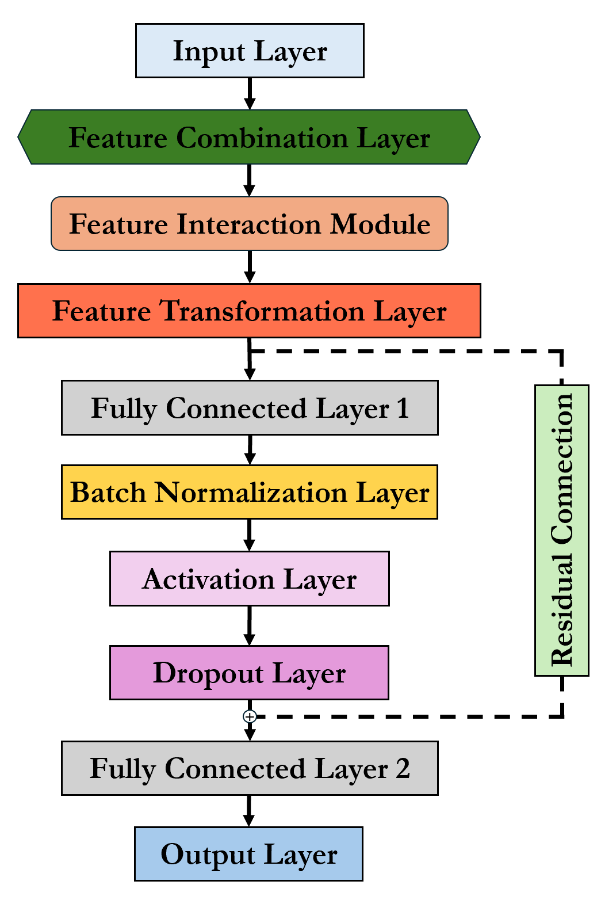

# Twisted Convolutional Networks (TCNs)

## Overview

Twisted Convolutional Networks (TCNs) introduce a novel approach to feature combination, addressing the limitations of traditional Convolutional Neural Networks (CNNs) when dealing with datasets without inherent spatial or temporal relationships. Unlike CNNs, which depend on the order of input features, TCNs generate new feature representations through combinations of feature subsets, mitigating the impact of feature order. This repository contains the implementation of TCNs as described in the paper, including training and evaluation scripts for benchmark datasets.


## Features

- **Feature Combination Layer**: TCNs generate combined features using both element-wise multiplication and summation of pairwise products, creating a richer feature representation that captures complex interactions.
- **Two Feature Combination Methods**: Offers flexibility with two approaches—multiplicative combination for direct feature interactions and summation of pairwise products for enhanced pairwise relationships.
- **Robust to Feature Order**: The approach reduces reliance on feature ordering, making TCNs suitable for non-spatial datasets.
- **Flexible Architecture**: Includes residual connections, dropout, and batch normalization for improved training stability and model generalization.



## Installation

To get started with Twisted Convolutional Networks, clone this repository and ensure you have the necessary dependencies installed.

### Clone the repository

```bash
git clone https://github.com/junbolian/Twisted_Convolutional_Networks.git
cd Twisted_Convolutional_Networks
```

### Dependencies

The main dependencies for running TCNs include:

- Python 3.7+
- TensorFlow or PyTorch
- NumPy
- Matplotlib
- MATLAB 2023+

You can install the dependencies using the following command:

```bash
pip install -r requirements.txt
```

## Usage

The repository provides scripts to train and evaluate TCN models on benchmark datasets such as Iris and custom datasets.

### Training

To train a TCN on a dataset, use the following command:

```bash
python train_tcn.py --dataset iris --epochs 200 --batch_size 10 --combination_method pairwise
```

Arguments:

- `--dataset`: Specify the dataset to be used for training (e.g., `iris`).
- `--epochs`: The number of training epochs.
- `--batch_size`: The batch size for training.
- `--combination_method`: Method for feature combination (`multiplicative` or `pairwise`).

### Evaluation

To evaluate a trained model, run:

```bash
python evaluate_tcn.py --model_path path/to/saved_model --dataset iris
```

Arguments:

- `--model_path`: Path to the saved model.
- `--dataset`: The dataset used for evaluation.

## Examples

This repository includes Jupyter notebooks demonstrating the use of TCNs on different datasets. You can find these notebooks in the `notebooks` folder. To get started, open a notebook and run the cells to see the TCN in action.

## Model Details

TCNs utilize a feature combination strategy to generate higher-order features that capture the interactions between original features. Specifically, for an input with `n` features, TCNs generate `C(n, 2)` combinations using either element-wise multiplication or summation of pairwise products. The resulting combined features are then fed into fully connected layers, which include batch normalization, ReLU activation, and dropout for generalization. The TCN model aims to mitigate reliance on feature order and provides a more robust representation for classification tasks.

## Results

The TCN model was evaluated on several benchmark datasets and compared with traditional CNNs. Experimental results demonstrate that TCNs outperform CNNs in scenarios where feature order is arbitrary or non-sequential. For more details, please refer to the `results` folder or the associated paper.

## Citation

If you use this code or find this work helpful, please consider citing our paper:

```latex
@article{lian2024tcns,
  title={Twisted Convolutional Networks (TCNs): Enhancing Feature Interactions for Non-Spatial Data Classification},
  author={Junbo Jacob Lian},
  journal={arXiv preprint arXiv:XXXX.XXXXX},
  year={2024}
}
```

## License

This project is licensed under the MIT License - see the [LICENSE](LICENSE) file for details.

## Contact

For any questions or inquiries, please contact Junbo Lian at [junbolian@qq.com](mailto:junbolian@qq.com).
